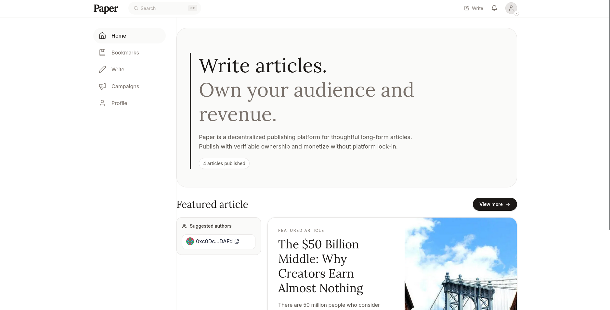
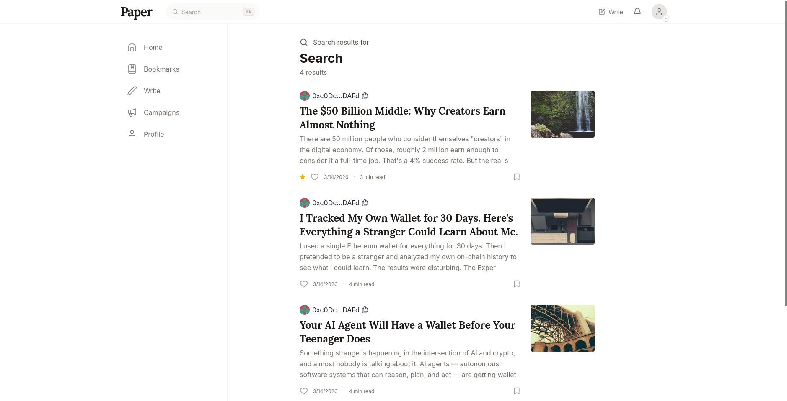

<p align="center">
  
</p>

A decentralized publishing platform built for **ETHMumbai 2026** in conjunction with **PaperBot**.

---

## Tech Stack

| Layer | Tech |
|-------|------|
| Frontend | Next.js, React, TypeScript, Tailwind CSS |
| Web3 | Wagmi, Viem, RainbowKit, x402 endpoints, ENS subnames |
| Smart Contracts | Foundry (Solidity), ERC-721 NFTs |
| Storage | IPFS (via Pinata) |

---

## What is this

A blockchain-based publishing platform where creators can publish articles as NFTs. Articles can be free or paid, with the platform supporting micro-payments via x402 protocol. Readers can unlock paid content by paying ETH or USDC directly to authors.

### Key Features

- **Publishing**: Create articles stored on IPFS, each tokenized as an ERC-721 NFT
- **Monetization**: Set custom prices for articles (ETH or USDC), readers pay via x402 to unlock full content
- **Ad Campaigns**: Run sponsored post campaigns on the platform
- **Profiles**: On-chain user profiles with ENS subname support for custom usernames
- **Bookmarks**: Save articles for later reading

---

## Screenshots

<p align="center">
  
  
</p>

---

## Getting Started

```bash
# Install dependencies
yarn install

# Start local blockchain
yarn chain

# Deploy contracts
yarn deploy

# Start frontend
yarn start
```

After deployment, ABIs are auto-generated to `packages/nextjs/contracts/deployedContracts.ts`.

### Environment Variables

Copy `.env.example` to `.env` and configure:

- `NEXT_PUBLIC_RPC_URL`:  RPC endpoint (defaults to local Anvil)
- `NEXT_PUBLIC_PAPER_CONTRACT_ADDRESS`: Paper contract address
- `NEXT_PUBLIC_SOCIAL_CONTRACT_ADDRESS`: Social contract address
- `NEXT_PUBLIC_AD_CAMPAIGNS_CONTRACT_ADDRESS`: AdCampaigns contract address
- `NEXT_PUBLIC_PINATA_GATEWAY`: IPFS gateway
- `NEXT_PUBLIC_X402_FACILITATOR_URL`: x402 facilitator URL

### Network

The contracts are deployed on **Base Sepolia** testnet.

Visit `http://localhost:3000` to use the app.

---

## Project Structure

```
packages/
├── foundry/
│   ├── contracts/      # Smart contracts (Paper.sol, AdCampaigns.sol, Social.sol)
│   └── script/         # Deployment scripts
└── nextjs/
    └── app/            # Next.js frontend (App Router)
```

---

## License

MIT

---

## Credits

Built on top of [Scaffold-ETH 2](https://github.com/scaffold-eth/scaffold-eth-2).
